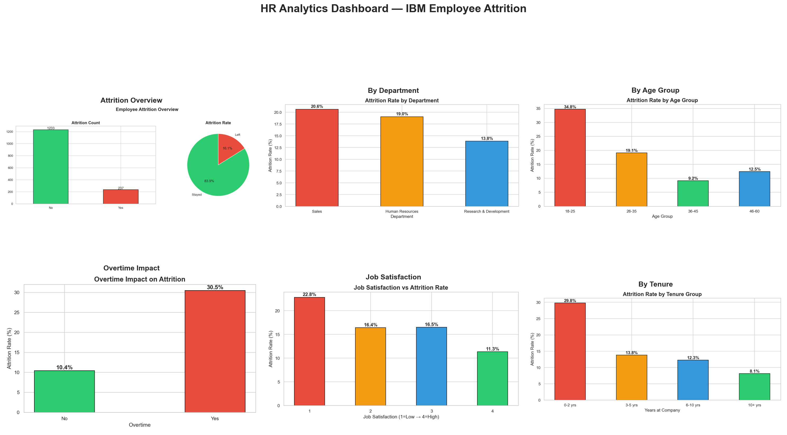

# 👥 HR Analytics — Employee Attrition & Performance EDA

## 📌 Overview
Exploratory Data Analysis on the IBM HR Analytics dataset (1,470 employees, 35 features) to uncover key drivers of employee attrition, analyse workforce diversity, and identify high-risk groups using Python.

## 📊 Dashboard Preview

## 🔍 Key Insights
- **Overall attrition rate: 16.1%** — 237 out of 1,470 employees left
- **Overtime is the #1 risk factor** — overtime workers leave at 30.5% vs 10.4% (no overtime)
- **Sales department** has the highest attrition rate among all departments
- **18–25 age group** has the highest attrition — early career employees leave most
- **Low salary band** employees have the highest attrition rate
- **Employees with 0–2 years tenure** are at highest risk of leaving
- **Low job satisfaction (rating 1)** correlates strongly with attrition
- **Poor work-life balance** employees leave significantly more often

## 📁 Project Structure

## 🛠️ Tools & Libraries
| Tool | Purpose |
|------|---------|
| Python 3.13 | Core language |
| Pandas | Data loading, cleaning, feature engineering |
| NumPy | Numerical operations |
| Matplotlib | Chart building |
| Seaborn | Statistical visualizations |
| VS Code + Jupyter | Development environment |

## 📐 DAX Equivalent — Python Metrics Created
| Metric | Method |
|--------|--------|
| Attrition Rate % | `mean()` on binary flag column |
| Age Groups | `pd.cut()` with custom bins |
| Salary Bands | `pd.cut()` on MonthlyIncome |
| Tenure Groups | `pd.cut()` on YearsAtCompany |
| Dept Attrition Rate | `groupby().mean()` |

## 💡 Business Recommendations
1. **Reduce overtime** — mandatory OT is the single biggest attrition driver
2. **Focus retention on 18–25 age group** — mentorship & career growth programs
3. **Review Sales dept compensation** — highest attrition needs urgent attention
4. **Improve onboarding** — 0–2 year employees leave most, invest in early engagement
5. **Salary benchmarking** — low salary band has critical attrition levels

## 📂 Dataset Source
[IBM HR Analytics Employee Attrition & Performance — Kaggle](https://www.kaggle.com/datasets/pavansubhasht/ibm-hr-analytics-attrition-dataset)